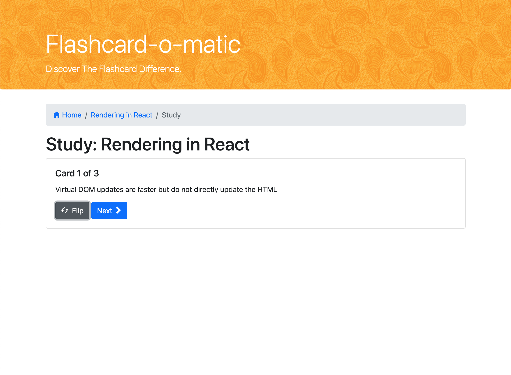
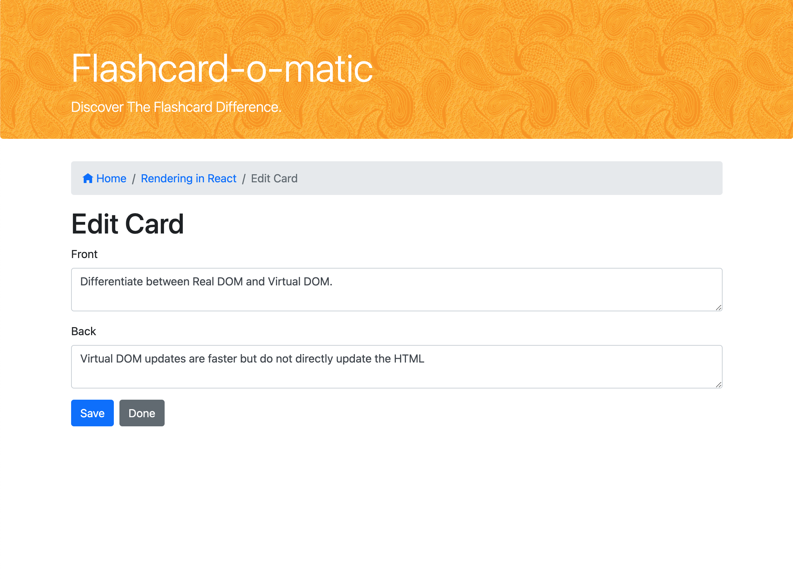

#
# Flashcard-o-matic

Flashcard-o-matic is here to help students study online.  You can create decks and cards, then study them as flashcards. Both decks and cards can be edited or deleted. Additional cards can be added to a deck.

#
## Implemented using
* React 
* Javascript
* HTML / JSX 
* CSS
* Bootstrap
* React Router
* React Hooks (useState, useEffect)

#
## Additional small features

* Fully responsive
* Added custom modal prompts as it's less intrusive to users
    * It allowed to color decks that are about to be deleted, so users can visually confirm it
    * Universal and can be used for different components
* Some basic error handling for different actions
    * Updating...
    * Loading...
    * Failed to fetch deck
    * Failed to delete deck
* Universal Breadcrumbs

#
## Future Plans

* Get server up and running
* Study progress and ability to go back/forth between cards
* Add timer
* Animating flipping cards

## SCREENSHOTS

### Home Page:
The home page displays a card for each deck as well as a button to create a new deck.

### Study:
Study a deck. Flip to reveal the back of a card.

- **Flip**: view the back of the card
- **Next**: view the next card

### Deck View:
Viewing a deck reveals the deck's full description, all it's associated cards and options to study, edit, or delete the deck, and add to, edit or delete the cards.

- **Edit**: users are able to edit the deck name and description
- **Study**: enter study mode
- **Add Cards**: add individual cards to a selected deck
- **Delete**: Delete deck

### Add / Edit Cards Views:
Easily add as many cards as you want or edit one of the old ones.

- **Edit**: Edit card front and back
- **Add**: Add card front and back
- **Delete**: Delete card

### Add / Edit Deck Views:
Create new decks with ease or update name and descriptions of the ones you already have.

- **Edit**: Edit deck name and description
- **Add**: Add deck name and description
- **Delete**: Delete deck

